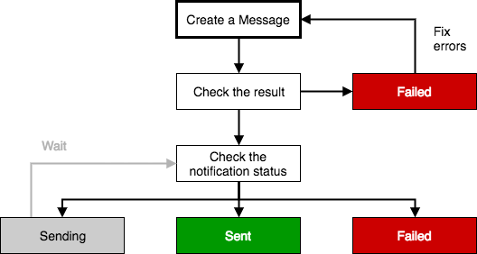
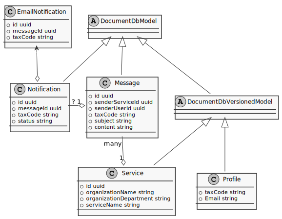

# Digital Citizenship APIs

[](https://circleci.com/gh/teamdigitale/digital-citizenship-functions/tree/master)

[](https://david-dm.org/teamdigitale/digital-citizenship-functions)

[](https://codecov.io/gh/teamdigitale/digital-citizenship-functions)

[](https://codeclimate.com/github/teamdigitale/digital-citizenship-functions)

[](https://codeclimate.com/github/teamdigitale/digital-citizenship-functions/coverage)

[](https://codeclimate.com/github/teamdigitale/digital-citizenship-functions)

[](https://snyk.io/test/github/teamdigitale/digital-citizenship-functions)

[](https://www.codacy.com/app/cloudify/digital-citizenship-functions?utm_source=github.com&amp;utm_medium=referral&amp;utm_content=teamdigitale/digital-citizenship-functions&amp;utm_campaign=Badge_Grade)

[](https://app.fossa.io/projects/git%2Bgithub.com%2Fteamdigitale%2Fdigital-citizenship-functions?ref=badge_shield)

## Introduction

This is the implementation of the Digital Citizenship API, a set of services
that enable Public Administrations to deliver modern digital services to
citizens.

The functionality exposed by the Digital Citizenship API focus on end-to-end
communication between the Public Administrations and the citizens and the
delivery of personalized digital services based on the citizen's preferences
(e.g. location, language, etc...).

For further details about the Digital Citizenship initiative, checkout the
[main Digital Citizenship](https://github.com/teamdigitale/cittadinanza-digitale)
repository.

## Services provided by the Digital Citizenship API

### Messages

Public administration agencies receive millions of requests every year from
citizens anxious to find out about the progresses of their application or whether
a payment has been received. Citizens have to spend time on hold, which wastes
their time and costs government a lot of money in running call centres.
Moreover, citizens forget about or miss payment deadlines costing them overtime
fees.

The messages service makes it easier to keep citizens updated, by helping
service teams across public administration agencies to send text messages,
emails or letters to the citizens.

#### How messages work

Public administration services can send notifications to citizen by calling
the messages API from their web applications, back office systems or batch jobs.
The messages service provides flexibility and resilience by having a number of
SMS, email and post providers. It’s straightforward for us to swap these
providers in and out, based on price, performance etc, with no effort or impact
on government service teams.

The messages service is for sending transactional messages, not for marketing.
There is a risk that marketing messages may be reported as spam, which would
affect delivery rates.

### Preferences

Modern digital services are designed for delivering personalized experiences
to the users. Today, a citizen that wishes to provide personal information and
preferences to the services he uses, has to provide his preferences over and
over again to all services; that's because most public digital services don't
share any information.

The preferences service makes it easier for the citizen to provide his personal
preferences (i.e. contacts information, payment preferences, language, etc...)
in a central repository that digital services across public administration can
use to provide a more personalized digital experience to citizens.

#### How preferences work

Public administration services can query a citizen preferences by calling the
preferences API from their web applications.
The preferences service provides fine control on what preferences attribute a
certain application can read or write, making handling user provided information
safe and painless.

The preferences service is for delivering personalized digital services, not for
collecting citizens emails or mobile numbers. For any transactional
communication need, the messages service must be used.

## Using the Digital Citizenship API

### Trial mode

All new accounts on the Digital Citizenship API starts off in trial mode.

This means:

* you can only send messages with email notifications to yourself
* you can only send 50 messages per day

As soon as you’re ready, we can remove these restrictions.

### Message sending flow



[Edit diagram](https://www.draw.io/#G0By3amPPe9r4uNWw4NkJQYXk1M3M)

If a notification fails for a certain notification channel because the user
has not configured that channel and you haven't provided a default address
for that channel, nothing can be done.

### Delivery and failure

Our delivery states are:

* Sending
* Delivered
* Phone number or email address not provided
* Technical failure

#### Sending

All messages start in the `Sending` state.

This means that we have accepted the message. It’s waiting in a queue to be
sent to our email or text message delivery partners.

#### Delivered

This means the message is in the person’s email inbox or on his/her phone.

We can’t tell you if they’ve read it — to do so would require invasive and
unreliable tracking techniques.

#### Phone number or email address not provided

You haven't provided any address to reach the citizen (email phone number),
and the citizen you're trying to contact doesn't have any contact preferences
in his profile.

#### Technical failure

This means there is a problem with the connection between the messages API
system and our email or text message delivery partners.

Notifications still being retried are marked as `Sending`. We mark notifications
as `Technical failure` once we’ve given up.

## Architecture

### Design principles

The design of the system strives to follow the functional paradigm as much as
possible.

Most data structures are immutable and the vast majority of data models are
versioned and immutably stored in the database.

The business logic is designed to be purely functional and segregated from
the non-functional, non-typesafe parts (interface to the Azure Functions
framework, the database and the Express framework).

### Application architecture

The application is structured in three layers:

|Layer|Responsibilities|
|-|-|
|Presentation|Handling of HTTP requests|
|Domain|Business logic|
|Data Source|Communication with databases, messaging systems and 3rd party APIs|

#### Presentation layer

The presentation layer follows the
[front controller pattern](https://martinfowler.com/eaaCatalog/frontController.html)
and handles the HTTP requests for the API resources.

The [main API controller](https://github.com/teamdigitale/digital-citizenship-functions/blob/master/lib/public_api_v1.ts)
is based on [Express.js](https://expressjs.com/) (that handles the routing and
the request parsing phases).

The controller relies on [shared middlewares](https://github.com/teamdigitale/digital-citizenship-functions/tree/master/lib/utils/middlewares)
for implementing shared functionalities exposed to the domain layer:

|Middleware|Responsibility|
|-|-|
|[Azure API Authentication](https://github.com/teamdigitale/digital-citizenship-functions/blob/master/lib/utils/middlewares/azure_api_auth.ts)|Extracts and validates authentication information from the request|
|[Azure User Attributes](https://github.com/teamdigitale/digital-citizenship-functions/blob/master/lib/utils/middlewares/azure_user_attributes.ts)|Extracts and validates metadata related to the API user|
|[Azure Context](https://github.com/teamdigitale/digital-citizenship-functions/blob/master/lib/utils/middlewares/context.ts)|Extracts the [Azure Functions context](https://docs.microsoft.com/en-us/azure/azure-functions/functions-reference-node#context-object) from the request|
|[Fiscal Code](https://github.com/teamdigitale/digital-citizenship-functions/blob/master/lib/utils/middlewares/fiscalcode.ts)|Extracts and validates the Fiscal Code parameter of the request|
|[Required Parameter](https://github.com/teamdigitale/digital-citizenship-functions/blob/master/lib/utils/middlewares/required_param.ts)|Checks the presence of a certain required parameter in the request and extracts its value|

The middlewares can be configured to be executed before each request and will
either pass through the extracted information or stop the processing of the
request by returning an error to the API client.

#### Domain layer

The domain layer follows the
[service layer pattern](https://martinfowler.com/eaaCatalog/serviceLayer.html)
and handles the business logic exposed through the API.

The service layer is composed of several specialized controllers that handle
operations for specific resources:

|Controller|Responsibilities|
|-|-|
|[Messages](https://github.com/teamdigitale/digital-citizenship-functions/blob/master/lib/controllers/messages.ts)|Handles operations on the Message resource|
|[Profiles](https://github.com/teamdigitale/digital-citizenship-functions/blob/master/lib/controllers/profiles.ts)|Handles operations on the Profile resource|
|[Info](https://github.com/teamdigitale/digital-citizenship-functions/blob/master/lib/controllers/info.ts)|Provides system runtime information|
|[OpenAPI](https://github.com/teamdigitale/digital-citizenship-functions/blob/master/lib/controllers/openapi.ts)|Provides the API specification in [OpenAPI](https://www.openapis.org/) format|

The specialized controllers are designed to follow the [Zalando RESTful API guidelines](https://zalando.github.io/restful-api-guidelines/index.html).

#### Data source layer

The data source layer follows the
[table data gateway pattern](https://martinfowler.com/eaaCatalog/tableDataGateway.html)
and handles the operations on the resources stored in the database.

Operations specific to the database technology have been encapsulated in a
[gateway object](https://martinfowler.com/eaaCatalog/gateway.html) that
[abstracts the DocumentDb API](https://github.com/teamdigitale/digital-citizenship-functions/blob/master/lib/utils/documentdb_model.ts)
exposed by CosmosDB. This approach decouples the
underlying data store semantic from the application, making possible to
migrate the application to a different data store with little effort.

The data model is designed around several common techniques like
[identity field](https://martinfowler.com/eaaCatalog/identityField.html),
[foreign key mapping](https://martinfowler.com/eaaCatalog/foreignKeyMapping.html)
and [value object](https://martinfowler.com/eaaCatalog/valueObject.html).

### Data architecture

The data model is composed of the following core entities:

|Entity|Description|
|-|-|
|[Profile](https://github.com/teamdigitale/digital-citizenship-functions/blob/master/lib/models/profile.ts)|Represents the profile of a citizen (i.e. his preferences)|
|[Message](https://github.com/teamdigitale/digital-citizenship-functions/blob/master/lib/models/message.ts)|Represents a message sent to a citizen by a service owned by an Organization|
|[Notification](https://github.com/teamdigitale/digital-citizenship-functions/blob/master/lib/models/notification.ts)|Represents a notification to the citizen, triggered by a Message|
|[Service](https://github.com/teamdigitale/digital-citizenship-functions/blob/master/lib/models/service.ts)|Represents the Service, owned by an Organization, that sends the messages or access citizen's profiles|

The data model defines also several non-core entities used to describe events
happening inside the application:

|Entity|Description|
|-|-|
|[Created Message Event](https://github.com/teamdigitale/digital-citizenship-functions/blob/master/lib/models/created_message_event.ts)|Gets triggered by the Messages controller when a new Message gets created|
|[Notification Event](https://github.com/teamdigitale/digital-citizenship-functions/blob/master/lib/models/notification_event.ts)|Gets triggered for each notification channel when a new Notification gets created|

The following diagram describes the relationship between the above entities:



### Integration architecture

The system is designed around loosely coupled components that communicate
through REST interface or asynchronous messaging queues.

Some components are provided by Azure services while other are custom.

#### Azure components

|Component|Responsibilities|
|-|-|
|[API Management](https://docs.microsoft.com/en-us/azure/api-management/)|API gateway, client and permission management, authentication and pre-processing of requests|
|[Functions](https://azure.microsoft.com/en-us/services/functions/)|Runtime environment for custom application logic|
|[CosmosDB](https://docs.microsoft.com/en-us/azure/cosmos-db/)|Database for structured data|
|[Queue Storage](https://azure.microsoft.com/en-us/services/storage/queues/)|Messaging infrastructure|
|[Blob Storage](https://azure.microsoft.com/en-us/services/storage/blobs/)|Unstructured storage|
|[Application Insights](https://azure.microsoft.com/en-us/services/application-insights/)|Application instrumentation and analysis|

#### Custom components

|Component|Responsibilities|
|-|-|
|[Public API controller](https://github.com/teamdigitale/digital-citizenship-functions/blob/master/lib/public_api_v1.ts)|Front controller for public APIs|
|[CreatedMessage handler](https://github.com/teamdigitale/digital-citizenship-functions/blob/master/lib/created_message_queue_handler.ts)|Processor for `CreatedMessage` events|
|[EmailNotification handler](https://github.com/teamdigitale/digital-citizenship-functions/blob/master/lib/emailnotifications_queue_handler.ts)|Processor for `EmailNotification` events|

#### Request processing

What follows is a brief description of how requests and events get processed
by the components.


[Edit diagram](https://www.draw.io/#G0By3amPPe9r4udnZUN01uLXRrTWs)

1. An API client sends a request to the public endpoint of the API.
1. The public endpoint forwards the request to the Azure API Management
  system.
1. The Azure API Management system looks up the credentials provided by the
  client and validates them, it will also lookup the groups associated with the
  client.
1. The Azure API Management system forwards the request to the API Function
  implementing the REST API, enriching it with authentication data (e.g., the
  client user ID and the associated groups).
1. The API Function processes the requests. Most CRUD requests will need to
  interact with the data store.
1. If the request created a new `Message`, a _new message_ event gets pushed
  to the _new messages_ queue.
1. A function that maps the _new message_ to the _notifications_ gets
  triggered for each new event consumed from the _new messages_ queue.
1. For each new `Message`, the function will lookup the notification
  preferences for the `Profile` associated to the recipient of the `Message`
  and create a pending `Notification`. If the user enabled the
  _message inbox_, the content of the `Message` will also be persisted
  and associated to the `Message` record in a blob container named `message-content`.
1. In case one or more notification channels have been configured in the
  `Profile` preferences, a _new notification_ gets pushed to each configured
  channel queue (e.g., email, SMS, push notification, etc...).
1. A function responsible for handling _new notification_ for a specific
  notification channel gets triggered.
1. Each _new notification_ event triggers a call to a _channel endpoint_
  (e.g., an MTA, a 3rd party API, etc...) that will send the content of the
  `Notification` to the recipient through the channel.
1. The result of the call is stored in the `Notification`.

## Security

### Authentication of requests

Authentication of requests is handled by the Azure API Management service.
Currently the system relies on a custom API token for authenticating clients.
The token is transmitted in the HTTP request custom header `Ocp-Apim-Subscription-Key`
and is tied to one user account belonging to an Organization.

### Authorization of requests

Access rights to the resources is based on
[scopes](https://zalando.github.io/restful-api-guidelines/index.html#105).
Each scope has a corresponding custom group in the Azure API Management service
(e.g., the `ProfileRead` scope has a corresponding `ProfileRead` group).

Most resources have read and write scopes (e.g. `ProfileRead`, `ProfileWrite`).

API clients can be allowed to any scope by adding the client to the scope's
group in the Azure API Management console (i.e., a client that is part of the
`ProfileRead` and the `ProfileWrite` groups will have read and write rights on
the `profiles` resource).

The currently supported scopes can be found in the
[Azure API Authentication middleware](https://github.com/teamdigitale/digital-citizenship-functions/blob/master/lib/utils/middlewares/azure_api_auth.ts#L27).

#### Authorization by client IP

Authorization of API requests can be restricted by client IP.
This access permission can be configured in the `Service` objects, through the
`authorizedCidrs` attribute.
This attribute must contain all the allowed CIDRs and IPs.
See the documentation of [cidr-matcher](https://www.npmjs.com/package/cidr-matcher)
for example values.

If the `authorizedCidrs` attribute for a service is not set (default), the API
will accept request from any IPs for that `Service`.

If the `authorizedCidrs` attribute for a service is set, the API will respond
with a `Not Authorized` response to requests originating from IPs that don't
match at least one of the provided CIDRs or IPs.

## Monitoring and instrumentation

### Application events

For monitoring and auditing purposes, the system emits application events to
the Azure Application Insights service.

Currently the system emits the following events:

* `api.messages.create`: when a message gets created (metadata includes
  `senderOrganizationId`, `senderUserId` and `success` status).
* `notification.email.delivery`: when an email notification gets delivered (
  metadata includes `addressSource`, `messageId`, `notificationId` and `mta`).

## Contributing

The API is developed in TypeScript, all code is under the `lib` directory.

Each Azure Function is declared in `host.json` (in the `functions` key) and has
a top level directory associated (e.g., `PublicApiV1`).
Each function directory contains a `function.json` that configures the bindings
and the reference to the function entrypoint from `lib/index.ts`.

### Quickstart

See the [development documentation](DEVELOP.md) to run the application for development.

### Code generation from OpenAPI specs

To gain the most from TypeScript's type safety we rely on compile-time code
generation of models from the OpenAPI specs.
This is still a work in process but eventually all code for data models of
requests and responses will likely be generated
from the API specs at compile time.

The OpenAPI specs are located under `api`.

The code is generated by the script `api/generate_models.ts` that uses simple
Jinja templates to translate the specs into TypeScript code.
The generator can be executed with:

```sh
$ yarn generate:models

// the command will output the models that have been generated
```

_Note_: You'll have to `install -h ts-node` first to make it work.

The generated code will be stored in `lib/api`.

### Code generation from MJML templates

For improved readability on as many devices as possible, we rely on
[MJML](https://mjml.io/) responsive email framework.

The MJML templates live under `templates/mjml`.

The MJML templates gets compiled to Typescript code by the `Makefile`
located in the root folder:

```sh
gulp generate:templates
```

### Unit Tests

Unit tests gets execute using Jest and are located in the `__tests__`
sub-directory of the module under test.

### Release process

The release process is implemented as a `gulp` task named `release`.

To cut a new release you simply run:

```shell
$ gulp release
[11:16:39] Using gulpfile ~/src/digital-citizenship-functions/gulpfile.js
[11:16:39] Starting 'release'...
...
RELEASE FINISHED SUCCESSFULLY
[11:17:28] Finished 'release' after 49 s
```

The `release` task does the following:

1. Runs some sanity checks on the repository.
1. Runs the unit tests.
1. Bumps the version to the next release version and adds a version tag.
1. Compiles the Typescript code into Javascript and runs
  [azure-functions-pack](https://github.com/Azure/azure-functions-pack) to
  create a deployable asset - the result is stored in a version-specific branch
  named `funcpack-release-vX.Y.Z` that is also pushed to `origin`.
1. Syncs a remote branch named `funcpack-release-latest` to the content of
  the `funcpack-release-vX.Y.Z` branch.
1. Bumps the version to the next snapshot version.

### Deployment process

Currently the deployment of the Azure Functions is triggerred by the
[GitHub continuous deployment](https://docs.microsoft.com/en-us/azure/azure-functions/functions-continuous-deployment)
trigger, that is linked to the `funcpack-release-latest` branch.

Thus, a deployment gets automatically triggered when by the
`funcpack-release-latest` branch gets updated by the `release` task.

#### Rollback

The rollback process is manual right now, if you want to revert to version
`x.y.z` you must reset the `funcpack-release-latest` branch to the release
branch you want to revert to:

```shell
git fetch
git checkout -t origin/funcpack-release-latest
git reset --hard origin/funcpack-release-x.y.z
git push -f
```


## License
[](https://app.fossa.io/projects/git%2Bgithub.com%2Fteamdigitale%2Fdigital-citizenship-functions?ref=badge_large)
